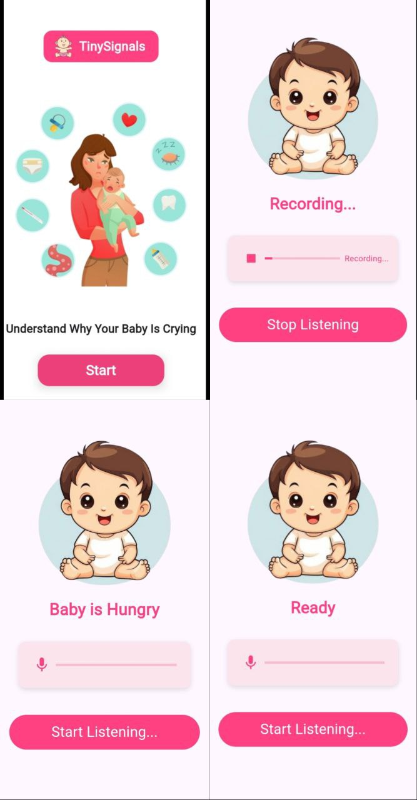

# TinySignals

This Flutter application helps to identify the possible reason behind a baby's cry using sound recognition technology. It detects the baby's cry, records the audio, and provides an interpretation of the cry (e.g., "Hungry", "Tired", "Uncomfortable").

## Features

- Audio Recording: Records the baby's cry using the microphone.
- Cry Detection: Analyzes the recorded audio and classifies the cry (e.g., "Hungry", "Tired").
- Real-Time Feedback: Provides real-time status on whether the application is recording or idle.
- User Interface: Simple and intuitive UI to guide users through the process.

## Requirements

- Flutter SDK 3.0 or later
- Android or iOS Device
- Permissions for microphone access

## Installation

Follow the steps below to set up the app:

1. Clone the Repository
Clone this repository to your local machine:

```bash
git clone https://github.com/Shymaa2611/TinySignals.git 

```
2. Install Dependencies

Navigate to the project folder:

```bash
cd TinySignals

```

Install required dependencies:

```bash
flutter pub get

```
3-Run the Application

Run the application on your connected device or emulator:
```bash
flutter run

```

## Usage

- Start the Application: Open the app, and you will be presented with a screen that has a "Start" button.
- Record the Cry: When you click "Start", the app starts recording the baby's cry.
- Detect the Cry: Once the recording is stopped, the app will analyze the sound and display the possible 
  reason behind the baby's cry (e.g., "Hungry", "Tired").
- Stop the Recording: If you need to stop recording earlier, simply click the "Stop" button.

## APP 



## Technologies Used

- Flutter: Framework for building cross-platform mobile applications.
- Flutter Sound: Package for recording and playing sound.
- Permission Handler: A Flutter plugin to handle permissions (like microphone access).
- API : That Detect what Baby 's Crying Means .